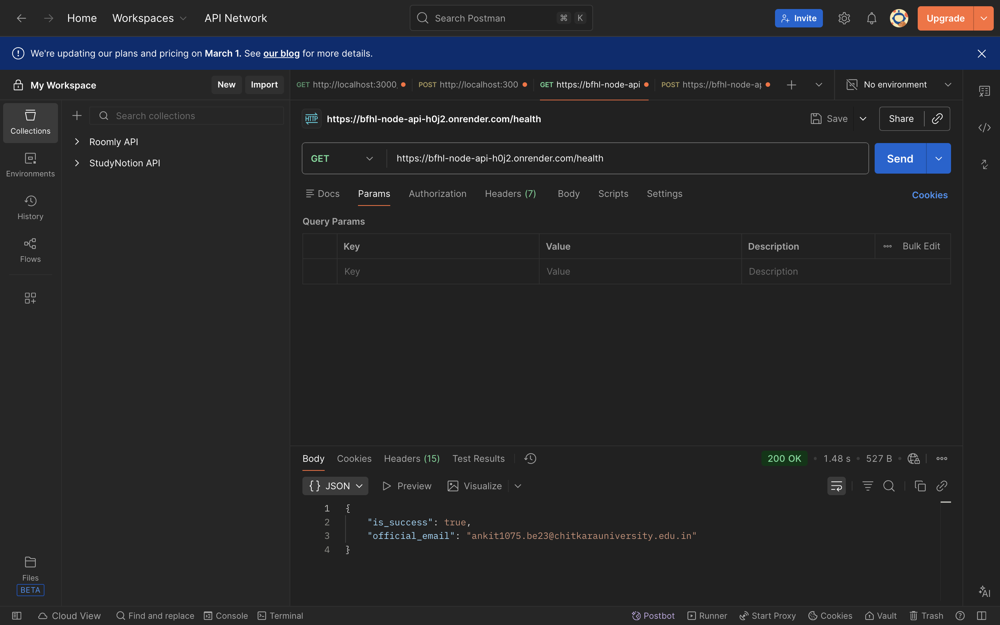
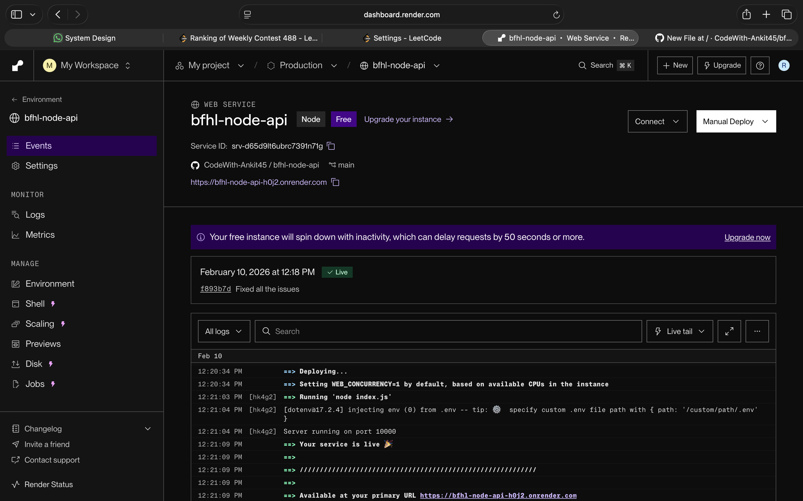

# BFHL Node API

This project is developed as part of the **BFHL Qualifier Round**.  
It provides two REST APIs built using **Node.js and Express**, deployed publicly on **Render**.

---

## 🚀 Live Deployment

**Base URL:**  
https://bfhl-node-api-h0j2.onrender.com

---

## 📌 APIs Implemented

### 1️⃣ GET `/health`

Checks if the service is running.

**Endpoint**

```
GET /health
```

**Response**
```json
{
  "is_success": true,
  "official_email": "ankit1075.be23@chitkarauniversity.edu.in"
}
```

### 2️⃣ POST `/bfhl`

Processes different operations based on the input key.

**Endpoint**

```
POST /bfhl
```

**Supported Inputs**
- `fibonacci` → Generates Fibonacci series
- `prime` → Filters prime numbers
- `lcm` → Calculates LCM
- `hcf` → Calculates HCF
- `AI` → Answers simple AI-based questions (with graceful fallback)

**Example Request**
```json
{
  "fibonacci": 7
}
```

**Example Response**
```json
{
  "is_success": true,
  "official_email": "ankit1075.be23@chitkarauniversity.edu.in",
  "data": [0, 1, 1, 2, 3, 5, 8]
}
```

---

## 🧠 AI Integration

- Integrated with Google Gemini API
- Uses environment variables for API key
- Implements graceful fallback in case of quota or rate-limit issues
- Ensures API never crashes

---

## 🛠 Tech Stack

- Node.js
- Express.js
- Axios
- Render (Hosting)

---

## 📂 GitHub Repository

https://github.com/CodeWith-Ankit45/bfhl-node-api

---

## 📸 Screenshots

Screenshots of:
- `/health` API response
- `/bfhl` API response
- Render deployment

are attached for reference.





---

## 👤 Author

**Ankit Kumar**  
ankit1075.be23@chitkarauniversity.edu.in

---
